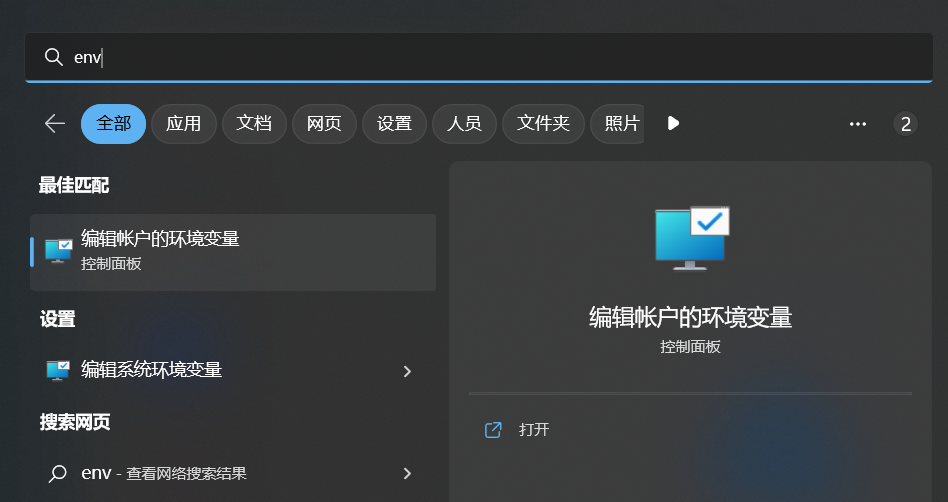
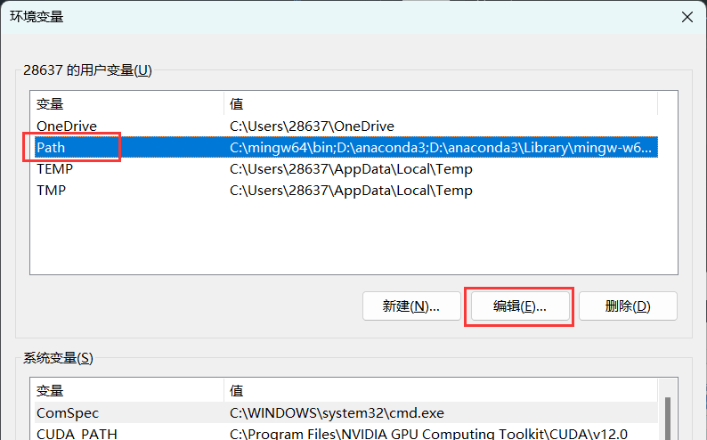
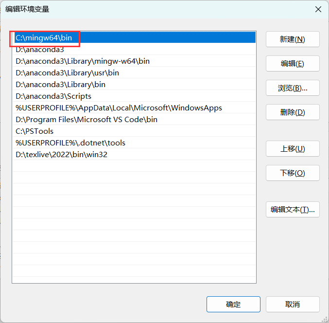
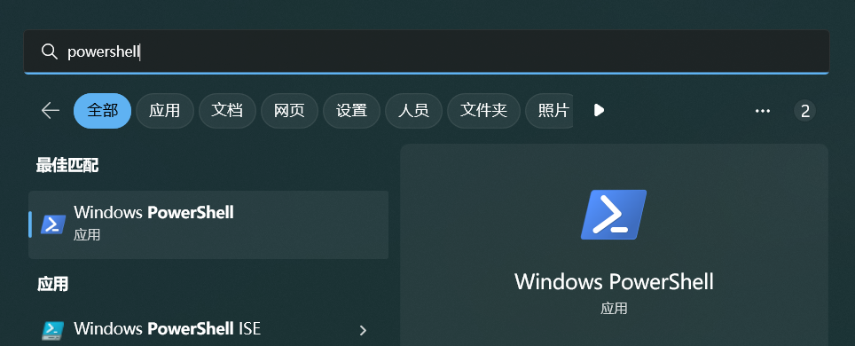
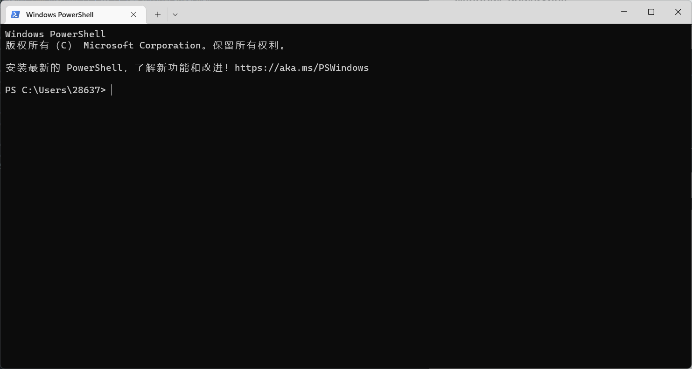
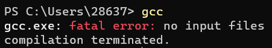
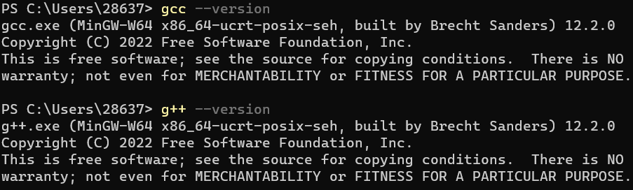
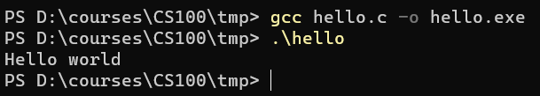
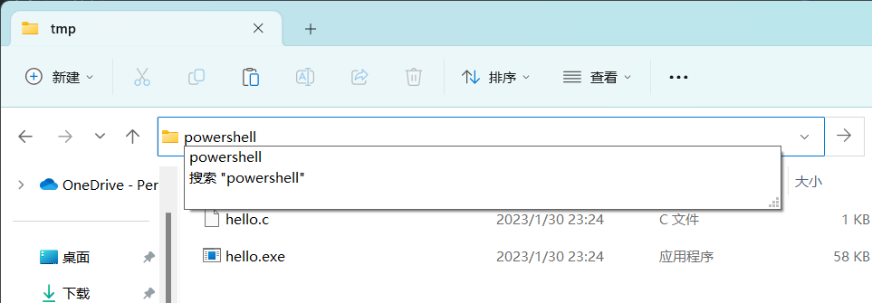

<!-- _class: cover_e -->
<!-- _header:  -->
<!-- _footer:  -->
<!-- _paginate: "" -->
# CS100 Recitation 0
###### Environment Setup

From Chaofan Li 
@lichf2025@shanghaitech.edu.cn

---

## Contents
<!-- _class: trans -->
<!-- _header: "" -->
<!-- _footer: "" -->
<!-- _paginate: "" -->

---
## Contents
<!-- _class: toc_a -->
<!-- _header: "Contents" -->
<!-- _footer: "" -->
<!-- _paginate: "" -->

- [1. 前置知识: 编辑器、编译器、IDE](#3)
- [2. 编译器的安装](#11)
- [3. 终端（命令行，命令提示符）](#23)
- [4.  Visual Studio Code](#35)

---
## 1. 前置知识: 编辑器、编译器、IDE
<!-- _class: trans -->
<!-- _header: "" -->
<!-- _footer: "" -->
<!-- _paginate: "" -->

---

## 1. 前置知识: 编辑器、编译器、IDE

- 编辑器：任何可以编辑文本的软件，例如记事本、Word、WPS 文字、手机备忘录

---

## 1. 前置知识: 编辑器、编译器、IDE

- 编辑器：任何可以编辑文本的软件，例如记事本、Word、WPS 文字、手机备忘录
  - 但我们需要的是**代码编辑器**，尤其是**现代代码编辑器**：
  - `Notepad++`, `Visual Studio Code`, `Vim`, `Sublime Text`, ...

---

## 1. 前置知识: 编辑器、编译器、IDE

- 编辑器：任何可以编辑文本的软件，例如记事本、Word、WPS 文字、手机备忘录
  - 但我们需要的是**代码编辑器**，尤其是**现代代码编辑器**：
  - `Notepad++`, `Visual Studio Code`, `Vim`, `Sublime Text`, ...
- 编译器：用来将高级语言的代码“翻译”成计算机真正能执行的代码
  - 比较流行的C/C++编译器：`GCC`(GNU), `Clang`(LLVM), `MSVC`(Microsoft), `ICC`(Intel), ...

---

## 1. 前置知识: 编辑器、编译器、IDE

- 编辑器：任何可以编辑文本的软件，例如记事本、Word、WPS 文字、手机备忘录
  - 但我们需要的是**代码编辑器**，尤其是**现代代码编辑器**：
  - `Notepad++`, `Visual Studio Code`, `Vim`, `Sublime Text`, ...
- 编译器：用来将高级语言的代码“翻译”成计算机真正能执行的代码
  - 比较流行的C/C++编译器：`GCC`(GNU), `Clang`(LLVM), `MSVC`(Microsoft), `ICC`(Intel), ...
- IDE：**I**ntegrated **D**evelopment **E**nvironment（集成开发环境）：代码编辑器 + 编译器 + 调试器 + 项目管理工具 + ......
  
---

## 1. 前置知识: 编辑器、编译器、IDE

- 代码编辑器：`Visual Studio Code`, `Vim`, `Sublime Text`, ...
- 编译器：用来将高级语言的代码“翻译”成计算机真正能执行的代码
- IDE：**I**ntegrated **D**evelopment **E**nvironment（集成开发环境）：代码编辑器 + 编译器 + 调试器 + 项目管理工具 + ......
  - 好的IDE有各种工具，例如 linter, profiler, 版本管理等等
  - **宇宙最强IDE**：Microsoft Visual Studio
  - 常见的IDE：VS, CLion, PyCharm, ...

---

## 1. 前置知识: 编辑器、编译器、IDE

- 代码编辑器：`Visual Studio Code`, `Vim`, `Sublime Text`, ...
- 编译器：用来将高级语言的代码“翻译”成计算机真正能执行的代码
- IDE：**I**ntegrated **D**evelopment **E**nvironment（集成开发环境）：代码编辑器 + 编译器 + 调试器 + 项目管理工具 + ......
  - 我们实际需要的是一个 IDE
  - 你可以直接使用像 CLion 或 VS 这样的狠货，也可以用编辑器 + 编译器 + ... 自己搭一套。

---

## 2. 编译器的安装
<!-- _class: trans -->
<!-- _header: "" -->
<!-- _footer: "" -->
<!-- _paginate: "" -->

---

## 2. 编译器的安装

GCC (MinGW) 和 Clang（可选，Winlibs 自带）

---

## 2. 编译器的安装
#### 2.1. Linux（以 Ubuntu 为例）

- `sudo apt install gcc g++` 或者 `sudo apt install build-essential` 即可安装默认版本的 `gcc` 和 `g++`，在 24.04 默认安装的是 gcc-13。

- 每个新版本的 GCC 都会增加对更新标准的支持：
  - gcc-9 → 对 C++17 支持比较完善；
  - gcc-11 → 改进了 C++20 的支持；
  - gcc-13/14 → 开始逐步实现 C++23 的特性
- 编译器优化更强，更好的错误检查与诊断

---
## 2. 编译器的安装
#### 2.2. Windows（WSL）

- 什么是 WSL

WSL（Windows Subsystem for Linux，Windows 的 Linux 子系统）
是微软推出的一项功能，它允许在 Windows 上原生运行 Linux 环境，无需虚拟机或双系统。

换句话说：在 Windows 里，你可以直接打开一个 Linux 终端，运行 apt, bash, gcc, python 等工具，就像真的在 Linux 下一样。

---
## 2.2. Windows（WSL）环境配置（推荐）
<!-- _class: cols-2 -->
<div class="ldiv">


</div>
<div class="rdiv">

WSL & linux 换源 (Ubuntu24.04)（请在点击[这里](https://github.com/Heaticy/CS100-recitations-fall2025/blob/main/env_setup/magic_code.md) 或者在piazza链接里面复制）


</div>

---
## 2. 编译器的安装
<!-- _class: bq-red -->
#### 2.2. Windows（WSL）
> Wsl & linux 配置gcc环境 

```bash
sudo apt update
sudo apt upgrade
sudo apt install gcc g++
```

---
## 2. 编译器的安装
#### 2.3. Mac环境配置

- 不用配，mac自带clang编译器
- 用下面的命令检查clang版本即可

```bash
clang --version
```

---
## 2. 编译器的安装
#### 2.4. Windows（本地环境）

无法直接安装 `GCC`，我们需要 `MinGW`（**Min**imalist **G**NU for **W**indows）
- 实际上，我们的是需要 `MinGW-w64`。原始意义上的 `MinGW` 停止维护很久了。

[Winlibs](https://winlibs.com/) 是个好东西！
- 在 **Download** 下选择 **UCRT runtime** 中标有 **(LATEST)** 的那个 release 里的 Win64 Zip archive（建议选带有 LLVM/Clang 的）

#### 我不识字：

[GCC 15.2.0 (with POSIX threads) + MinGW-w64 13.0.0 (UCRT) - release 1   (LATEST)](https://github.com/brechtsanders/winlibs_mingw/releases/download/15.2.0posix-13.0.0-ucrt-r1/winlibs-x86_64-posix-seh-gcc-15.2.0-mingw-w64ucrt-13.0.0-r1.zip)

---
## 2. 编译器的安装
#### 2.4. Windows（本地环境）

解压后将 `mingw64` 这个文件夹放在 C 盘或 D 盘，**路径最好简单一点**，例如 `C:\mingw64` 或者 `D:\mingw64`。

---
## 2. 编译器的安装
#### 2.4. Windows（本地环境）-Windows 环境变量

按 `Win` 键，输入 `env`，即可搜出这个选项



---
## 2. 编译器的安装
#### 2.4. Windows（本地环境）-Windows 环境变量

编辑 `Path`：



---

## 2. 编译器的安装
<!-- _class: cols-2 -->
<div class="ldiv">

#### 2.4. Windows（本地环境）-Windows 环境变量

新建一项，输入 `mingw64\bin` 所在的位置，最好把它移到最上面。

</div>
<div class="rimg">


</div>

---

## 3. 终端（命令行，命令提示符）
<!-- _class: trans -->
<!-- _header: "" -->
<!-- _footer: "" -->
<!-- _paginate: "" -->

---

## 3. 终端（命令行，命令提示符）

终端有很多种，如：
- Terminal 
- Shell
- Command Line 
- Command Prompt
- ......

---

## 3. 终端（命令行，命令提示符）
#### 3.1. Windows PowerShell

按 `Win`+`r` 输入 `powershell`，或者按 `Win` 输入 `powershell` 搜索，打开 Windows PowerShell



---
## 3. 终端（命令行，命令提示符）
#### 3.1. Windows PowerShell



---
## 3. 终端（命令行，命令提示符）
#### 3.2. 在终端使用指令
Windows PowerShell 常见命令（不一定全都掌握，但 `cd` 必须会）：
- `ls`： 列出当前工作目录（Current Working Directory, CWD）下的文件
  - 默认情况下打开 PowerShell，工作目录是`C:\Users\Username`
- `cd somePath`： 将工作目录切换到 `somePath`，可以是相对或绝对路径
  - `cd ..`： 切换到上一级目录
  - `cd 'D:\Program Files'`： 切换到 `D:\Program Files`。加引号是因为有空格
- `mkdir CS100`： 在当前工作目录下创建名为 `CS100` 的文件夹
- `rmdir CS100`： 删除这个文件夹
- `del file`： 删除名为 `file` 的文件

---
## 3. 终端（命令行，命令提示符）
#### 3.2. 在终端使用指令
输入 `gcc`，PowerShell 会试图在 `Path` 环境变量所包含的路径中寻找名为 `gcc.exe` 的可执行文件，它实际上位于 `mingw64\bin`

如果编译器的安装及 `Path` 设置正确，应当看到如下输出



---
## 3. 终端（命令行，命令提示符）
#### 3.2. 在终端使用指令

要查看编译器的版本：给出 `--version` 参数



`gcc` 和 `clang` 是 C 编译器，`g++` 和 `clang++` 是 C++ 编译器

---
## 3. 终端（命令行，命令提示符）
#### 3.3. 编译运行一个 Hello World 程序

假设你的 CS100 课程的文件夹位于 `D:\courses\CS100`
- 在 `D:\courses\CS100\tmp` 创建 `hello.c`，用记事本打开，输入如下代码
  
  ```c
  #include <stdio.h>
  int main() {
    puts("Hello world");
    return 0;
  }
  ```

---
## 3. 终端（命令行，命令提示符）
#### 3.3. 编译运行一个 Hello World 程序
- 打开 PowerShell 并切换到 `D:\courses\CS100\tmp`，输入如下命令

  ```
  gcc hello.c -o hello.exe
  ```

  将会得到可执行文件 `hello.exe`。该文件名由紧跟在 `-o` 之后的字符串指定。

---
## 3. 终端（命令行，命令提示符）
#### 3.3. 编译运行一个 Hello World 程序

在 PowerShell 里输入 `.\hello` 即可运行 `hello.exe`。

- 当然也可以双击运行，但你可能会看到它一闪而过。



---
## 3. 终端（命令行，命令提示符）
#### 3.3. 编译运行一个 Hello World 程序

也可以用资源管理器打开 `D:\courses\CS100\tmp` 后，在地址栏输入 `powershell`，这时打开的 PowerShell 的工作目录就是这个文件夹。



---
## 3. 终端（命令行，命令提示符）
#### 3.4. 向编译器传递参数
```
gcc hello.c -o hello.exe
```

跟在 `gcc` 之后的各项是传递给 `gcc.exe` 的**参数**。

- `hello.c` 是它需要编译的文件名
  - 如果它不在当前工作目录下，需要指明路径，例如 `..\..\CS101\pa1\a.c`
- `-o hello.exe` 指明生成的可执行文件的名字，也可以带有路径
  - Windows 下通常以 `.exe` 为后缀，Linux / Mac OS 下通常无后缀名
- 还可以有其它参数，例如 `-std=c17` 指明采用 2017 年发布的语言标准 C17，`-lm` 链接数学库，`--save-temps` 保留编译过程中产生的临时文件。
- 以上参数的顺序无所谓

---

## 4.  Visual Studio Code
<!-- _class: trans -->
<!-- _header: "" -->
<!-- _footer: "" -->
<!-- _paginate: "" -->

---
## 4.  Visual Studio Code
#### 4.1. What's VSCode?
VSCode 是一个现代的**代码编辑器**
- 它不能帮你**编译**程序
  - “为什么我的代码在 VSCode 上跑出来是这样...？”
- 但它有大量好用的插件，可以帮你一键调用编译器、方便地调试代码、版本管理、在远程/容器里开发，甚至上 QQ、逛知乎、听网易云、炒股......

---
## 4.  Visual Studio Code
#### 4.1. 下载、安装 VSCode

- 去[官网](https://code.visualstudio.com)
- 挑个好位置安装，例如 `D:\Program Files\Microsoft VS Code`，最好别挤在 C 盘里，**更不要装在桌面**！

---

## 4.  Visual Studio Code
#### 4.2. 配置 VSCode

VSCode 有 $N+1$ 套配置：
- 每个工作区/文件夹可以有自己的配置，以 `json` 文件的形式存放在 `.vscode` 目录下。（`.` 开头的文件/文件夹可能会被隐藏， `查看` - `显示` - `隐藏的项目`）
- 另外有一套全局配置，也是 `json` 文件的形式，存在于某个特定的位置。
- 某一项设置如果在当前工作区/文件夹的配置中出现了，就采用这里指定的值，否则采用全局配置中的值。

---
## 4.  Visual Studio Code
#### 4.3. 安装插件（扩展，extension）：

- Code Runner：提供一个按钮，运行一个特定的指令，可以一键编译运行
- C/C++：提供 C/C++ 代码高亮、静态分析等功能
- vscode-icons：更好的文件图标显示（安装后记得 enable）
- One Dark Pro / GitHub Theme：个人比较喜欢的颜色主题
- GlassIt-VSC：按 `Ctrl`+`Alt`+`z` 变透明，按 `Ctrl`+`Alt`+`c` 变回来
- Office Viewer (Markdown Editor)：我用它打开 pdf 和图片
- Chinese (Simplified) Language Pack for Visual Studio Code？

> 以上插件已经足够，不建议安装很多 C/C++ 相关的插件（例如 Clang Command Adapter、C/C++ Runner 等），否则配置起来很困难

个人不建议安装 VSCode 推荐的 C/C++ Extension Pack。

---
## 4.  Visual Studio Code
#### 4.4. 全局配置

按 `Ctrl`+`,`，或者左下角的齿轮 - `Settings`

- Code-runner: Save File Before Run 设为 true
- Code-runner: Run In Terminal 设为 true
- Code-runner: Ignore Selection 设为 true
- Editor: Format On Save 设为 true
- Editor: Format On Type 设为 true
- Editor: Accept Suggestion On Enter 个人建议设为 off，避免和换行冲突（按 `Tab` 仍然可以接受补全）

---

## 4.  Visual Studio Code
#### 4.5. 工作区配置

1. 为这门课程创建文件夹，例如 `D:\courses\CS100`
2. `File` - `Open Folder...`（快捷键是 `Ctrl`+`k`+`Ctrl`+`o`）打开 `CS100` 文件夹。
   
   - 以后每一次都要先打开 VSCode，再打开文件夹，再编辑文件；而不是直接右击文件 - 用 VSCode 打开。否则工作区的配置无法起效。
3. 创建 `D:\courses\CS100\.vscode` 文件夹，创建文件 `.vscode\settings.json` 和 `.vscode\c_cpp_properties.json`，去[这里](https://github.com/Heaticy/CS100-recitations-fall2025/blob/main/env_setup/vscode-config-files.md)复制这两个配置文件的内容。
   - 链接是 https://github.com/Heaticy/CS100-recitations-fall2025/blob/main/env_setup/vscode-config-files.md
   - 注意阅读“注意事项”。

---

## 4.  Visual Studio Code
#### 4.6. Code Runner 的配置解释

打开 `hello.c`，可以看到右上角有一个播放按钮，这个按钮来自于 Code Runner。

- 点击这个按钮（快捷键 `Ctrl`+`Alt`+`n`）时，Code Runner 会根据当前文件的语言在 `code-runner.executorMap` 中执行对应的指令。
- 以 `"c"` 为例：
  - `cd $dir` 是切换到当前工作目录。`$dir` 是 Code Runner 提供的一个变量。
  - `gcc '$fileName' -o '$fileNameWithoutExt.exe' -std=c17 -Wall -Wpedantic -Wextra` 是编译指令。`-std=c17` 指定语言标准为 C17，`-Wall -Wpedantic -Wextra` 开启了更多 warning。
  - `echo 'compilation ends.'` 是让它在编译完毕后吱一声。
  - `.\\'$fileNameWithoutExt'` 运行可执行文件。

---

## 4.  Visual Studio Code
#### 4.7. Debugger

打开 `hello.c`，点击 `运行` - `开始调试`（快捷键 `F5`），选 `C++ (GDB/LLDB)`，选 gcc。

- VSCode 会自动生成调试所需要的文件，例如 `tasks.json` 和 `launch.json`
- 可以自己尝试打断点、单步执行等功能
- 可以参考官网的 [Debug C++ in VSCode](https://code.visualstudio.com/docs/cpp/cpp-debug) 以及 [Configure C/C++ debugging](https://code.visualstudio.com/docs/cpp/launch-json-reference)
  
  - 个人体会：在学会使用 gdb 之前可能难以理解 VSCode 的调试功能，因为它实际上就是调用 gdb。实在不行就先“print-statement debugging”。

---

## 4.  Visual Studio Code
#### 4.8. 配置 VSCode

- 目前为止，以上配置已经足够，不要胡乱粘贴别人的配置文件。
- 遇到任何问题请首选 [官网](https://code.visualstudio.com) 和 [StackOverflow](https://www.stackoverflow.com)，或者在 Piazza 提问，或单独找TA。

---

## 4.  Visual Studio Code
#### 4.9. VSCode 的集成终端（Integrated terminal）

- `View` - `Terminal`（快捷键 `Ctrl`+`` ` ``）可以打开 VSCode 内置的终端，在 Windows 上它默认使用的是 PowerShell。
- Code Runner 的 Run Code 功能也会打开这个集成终端，因为我们在全局设置了 Run In Terminal。

#### 格式化代码

右键 - `Format Document`（快捷键 `Alt`+`Shift`+`f`）可以格式化整个文件。
- 我们已经在全局设置了 Format On Type 和 Format On Save

---

## 关于 CS100 Slides
用 Markdown 就能制作幻灯片？你需要 Marp for VSCode。

#### Chaofan Li
- 本学期习题课的材料将在 [GitHub](https://github.com/Heaticy/CS100-recitations-fall2025) 上开源，但可能不会上传 pdf 文件。
- VSCode 安装 "Marp for VS Code" 插件，然后打开我的 `.md` 文件，它就会自动识别为幻灯片。
- 预览和导出：
#### Yunxiang He
- 使用 Awesome Marp 制作更好看的 Slides！
- 访问  获得我只做的 Slides 模板！