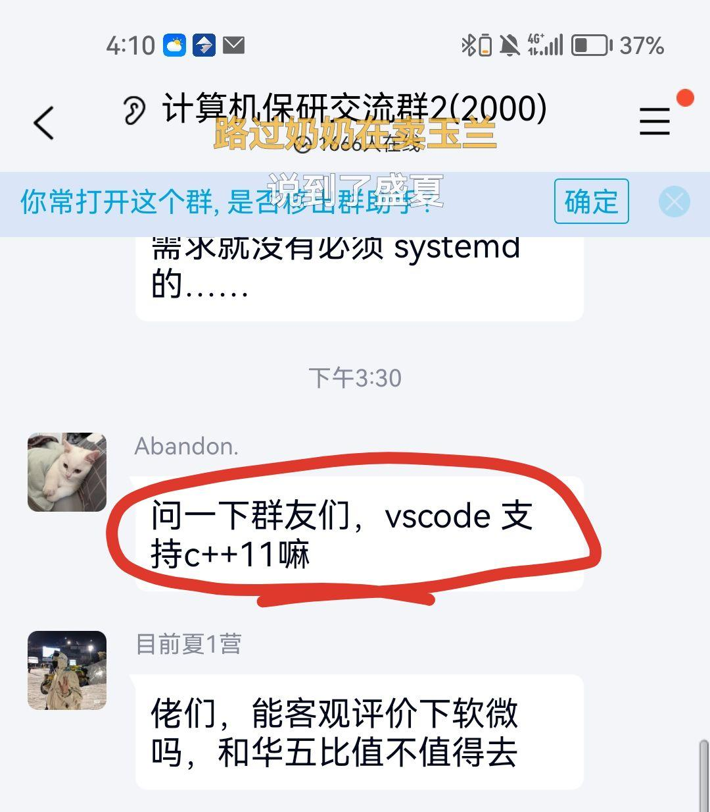

<!-- _class: cover_e -->
<!-- _header:  -->
<!-- _footer:  -->
<!-- _paginate: "" -->
# CS100 Recitation 1
###### Introduction to CS100 and C/C++

@lichf2025@shanghaitech.edu.cn
@heyx2025@shanghaitech.edu.cn

---

## Contents
<!-- _class: trans -->
<!-- _header: "" -->
<!-- _footer: "" -->
<!-- _paginate: "" -->

---
## Contents
<!-- _class: toc_a -->
<!-- _header: "Contents" -->
<!-- _footer: "" -->
<!-- _paginate: "" -->

- [Grateful acknowledgment to GKxx for his outstanding efforts on CS100](#4)
- [TA Members](#6)
- [开始](#10)
- [Review](#15)
- [编译、运行一个 C 程序](#21)
- [初识函数](#28)
- [Tools](#58)

---

## Grateful acknowledgment to GKxx for his outstanding efforts on CS100
<!-- _class: trans -->
<!-- _header: "" -->
<!-- _footer: "" -->
<!-- _paginate: "" -->

---

## GKxx
> GKxx is a 20-level student from ShanghaiTech , majoring in Computer Science and Technology. He has been a TA for CS100 multiple times and has made significant contributions to the course.
- Bilibili: [GKxxISCAS](https://space.bilibili.com/1656746432?spm_id_from=333.337.search-card.all.click)
- GitHub: [GKxxUCAS](https://github.com/GKxxUCAS)


---

## TA Members
<!-- _class: trans -->
<!-- _header: "" -->
<!-- _footer: "" -->
<!-- _paginate: "" -->

---
## TA Members
- 李超凡 `lichf2025@shanghaitech.edu.cn`
- 贺云翔 `heyx2025@shanghaitech.edu.cn`
- 张雍治 `zhangyzh2022@shanghaitech.edu.cn`
- 蒋烨 `jiangye2022@shanghaitech.edu.cn`
- 陆渊吉 `luyj2023@shanghaitech.edu.cn`
- 王诗涵 `wangshh2023@shanghaitech.edu.cn`
- 张帆 `zhangfan2025@shanghaitech.edu.cn`

More information can be found on Piazza under ["Staff"](https://piazza.com/shanghaitech.edu.cn/fall2025/cs100/staff).


---
## 3. 开始
<!-- _class: trans -->
<!-- _header: "" -->
<!-- _footer: "" -->
<!-- _paginate: "" -->

---
## 3. 开始
#### 3.1. 为什么要学 C/C++ ？

- 为什么要学微积分/离散数学/XXXX/......？

**重走一个学科/领域从无到有的发现历程**

- 理解学科中的基本思想、基本方法、里程碑、走过的弯路
- 锻炼学习的能力
- 应用、创新、革命 ......

---
## 3. 开始
#### 3.2. 怎样学好这门课

关键：**把课件、课本等资料上的示例代码独立地实现一遍**

- 作业也会有很多直接来自于课件（包括习题课）的题目
  - 看懂、掌握基本的知识
  - （尝试）独立地实现
  - 对比课件上的写法，有什么区别？哪种更好？
- 仅仅做到能“看懂”是**不够的**，只有独立实现才能内化为自己的知识。
  - 学数学也是如此。

---
## 3. 开始
#### 3.3. 关于学术诚信

我们采取相对宽松的规则。

- 简单题、教学题不查重，鼓励模仿和借鉴**好的写法**、**好的思路**。
  - 部分题目会设置与 TA 的线下 check 。
- **允许**帮别人 debug 。
- 鼓励使用 AI 工具辅助学习，比如让 ChatGPT/Copilot 帮你解释代码。
  - 注意谨慎求证。
- 但是禁止**直接抄袭**来自他人、网络、 AI 生成的代码。

---
## About TA's responsibilities...
<!-- _class: cols-2 -->

<div class="ldiv">

#### You can ask TAs to:
- 帮你看看你代码可能存在的问题
- 帮助你理解课程内容
- 向 TA 寻求学习建议
- ...
</div>
<div class="rdiv">

#### TAs can refuse you to:
- **给 AI 生成的代码 Debug**
- 在你没有进行**任何有意义的探索**的情况下帮你 Debug
- 咨询请假事务和其他事务
- 在 Deadline 之前提供你正确的代码
- 延长作业 Deadline
</div>

---
## 4. Review
<!-- _class: trans -->
<!-- _header: "" -->
<!-- _footer: "" -->
<!-- _paginate: "" -->

---
## 4. Review
#### 4.1. 环境配置
- Option 1 : Code editor + Compiler
  - Code editor（代码编辑器）: VS Code
  - Compiler（编译器）: MinGW (Minimal GNU for Windows) is suggested for Windows users.
- Option 2 : IDE（Integrated Development Environment，集成开发环境）
  - CLion, Virtual Studio...

**如果你刚刚开始，建议使用 `VS Code`**，因为它通常可以满足你作为初学者的所有需求。

随着项目的增长和任务的变得更加复杂，您可能需要考虑在工具链中添加一个 IDE，因为它们可以帮助您完成一些非常具有挑战性的日常任务。

---
## 4. Review
#### 4.2. Introduction to C/C++

- C / C++ 和 Python 有什么不同
  - C / C++ 的**编译**（Compile）
  - Python **解释**（Inteprete）
- 如何运行一个 C 语言程序？

---
## 4. Review
#### 4.3. 编译语言和解释语言


---
## 4.3. 编译语言和解释语言
<!-- _class: cols-2 -->
<div class="ldiv">

#### 编译性语言会更有效率

- C 语言会把程序在编译的时候编译成二进制执行文件（`.exe` / `.o`）
- 为了方便有时候程序员会把万行代码拆成几百份小文件（`.c` / `.h`）
  - 几百个源代码文件可以编译为几百个二进制执行文件（`.o`）
  - 修改一行代码不需要编译所有的代码，只用编译那一行代码所在的一个文件

</div>
<div class="rdiv">

#### 解释性语言会更有灵活性

- java 和 python 的源文件会在它们被运行的时候被**解释**成字节码
- 字节码是与平台无关的指令
- 因此，解释型语言通常具有“一次编写，到处运行”的特性


</div>


---
## 5. 编译、运行一个 C 程序
<!-- _class: trans -->
<!-- _header: "" -->
<!-- _footer: "" -->
<!-- _paginate: "" -->

---
## 5. 编译、运行一个 C 程序
#### 5.1. 编译和运行的基本流程
假设我们现在有一个文件 "hello.c".
- 首先，我们需要编译它。
  - Command: `gcc hello.c -o hello`
    - `-o`" 即为指定输出文件的名字。如果没有`-o`，文件名就默认为"a"
  - 编译之后，**可执行文件**被生成
    - On Windows, it will be named "`hello.exe`".
    - On Linux/MacOS, it will be named "`hello`".
- 接下来，我们需要运行可执行文件：
    - Command: Linux/MacOS: `./hello`; Windows: `.\hello`
    - 当然你也可以双击它，但它会“一闪而过”。（因为运行结束后窗口就会关闭）

---
## 5. 编译、运行一个 C 程序
<!-- _class: bq-red -->
#### 5.2. 在终端中编译和运行
> 将编译和运行的命令一同进行
> 
> We should type `gcc hello.c -o hello` and `./hello` in the **terminal（终端）** to compile and run.
- 终端是一个CLI（命令行界面），允许您与操作系统通信。您必须要求**操作系统**为您运行可执行文件。

**在 VSCode/CLion 的终端中执行以上指令：**

- VSCode: `ctrl`+`` ` `` 开启终端，默认 working directory 为当前打开的文件夹。
  - 这就是为什么我们建议在 VSCode 中打开一个文件夹而不是单个文件。
- CLion: 最下面 "Terminal"/“终端”，或 `Alt`+`F12`
- 可以先 `cd` 到方便的位置（如果需要的话）。


---
## 5. 编译、运行一个 C 程序
#### 5.3. 环境变量 `PATH`

当你执行 `gcc hello.c -o hello` 的时候，你唤醒的 `gcc` 是你安装在某处的 `gcc` (Linux/Mac) / `gcc.exe` (Windows)

例如，Windows 上的 `D:\mingw64\bin\gcc.exe`

终端如何认识到你想找的 `gcc` 是 `D:\mingw64\bin\gcc.exe`？

---
## 5. 编译、运行一个 C 程序
#### 5.3. 环境变量 `PATH`


当你执行 `gcc hello.c -o hello` 的时候，你唤醒的 `gcc` 是你安装在某处的 `gcc` (Linux/Mac) / `gcc.exe` (Windows)

例如，Windows 上的 `D:\mingw64\bin\gcc.exe`

终端如何认识到你想找的 `gcc` 是 `D:\mingw64\bin\gcc.exe`？

- 将 `D:\mingw64\bin` 添加到环境变量 `PATH`。
- `PATH` 存储了一系列目录，当你在终端中输入一个命令时，系统会在这些目录中依次查找对应的可执行文件。

---
## 5. 编译、运行一个 C 程序
<!-- _class: cols-2-46 -->

<div class="ldiv">

**VSCode/CLion 本身不具备任何编译、运行、调试的功能！**

它只是把编译器、可执行文件和 GDB 的结果打在公屏上，然后给你提供一些方便操作的按钮。

请分清编辑器、编译器和 IDE 的区别！

</div>
<div class="rimg">


</div>

---
## 6. 初识函数
<!-- _class: trans -->
<!-- _header: "" -->
<!-- _footer: "" -->
<!-- _paginate: "" -->

---
## 6. 初识函数
#### 6.1. 定义一个函数

语法：`ReturnType FunctionName(Parameters) { FunctionBody }`

- 数学上，函数是 $f:S\mapsto T$
- 一个函数的**参数**的类型对应 $S$，**返回值**类型对应 $T$。

例：下取整函数 $f(x)=\lfloor x\rfloor$ 的参数和返回值类型分别是什么？

```c
int floor(double x) {
  // ...
}
```

---
## 6. 初识函数
#### 6.1. 定义一个函数

一个函数可以接受多个参数（$f:S_1\times S_2\times\cdots\times S_n\mapsto T$），**每个参数的类型都需要写出来**。

- 哪怕它和前一个参数类型相同，也**不可以省去**。`(int x, int y)` 不可以省略为 `(int x, y)`

```c
ReturnType myFunction(Type1 a1, Type2 a2, Type3 a3) {
  // ...
}
```

---
## 6. 初识函数
#### 6.1. 定义一个函数

一个函数**可以没有返回值**，这样的函数返回值类型为 `void`。
```c
ReturnType do_some_work(void) {
  // ...
}
```

和数学函数不同，C 函数不仅仅是“接受一些参数、返回一个值”，它实际上就是**将一小段具有特定功能的代码单独拎出来，并且给它起个名字**。

---
## 6. 初识函数
<!-- _class: bq-red -->
#### 6.2. C 的历史遗留问题们
> 遗留问题 1
> 
> 函数参数列表空着并不代表不接受参数

和 C++ 不同，C 的参数列表为空，并不代表不接受参数，而是表示 "accepting unknown parameters"。这项规则自 C23 起才被删除。

- 这是 C 的一个历史遗留问题。上古时期的 C 并不注重参数类型检查，这可能更接近汇编的风格，但也更容易出错。

---
## 6. 初识函数
<!-- _class: bq-red -->
#### 6.2. C 的历史遗留问题们
> 遗留问题 2
> 
> 函数如果不写返回值类型，则返回值类型默认为 `int`

在 C99 之前，一个函数如果不写返回值类型，则返回值类型默认为 `int`。

事实上在旧的 C 语言中存在着大量的“默认为 `int`”的规则，在很多场合下这种写法极易引发难以预料的问题。

- 不幸的是，为了兼容已经存在的上亿行旧代码，编译器大概率会允许这种写法，并仅仅给出一个 warning。

---

## 6. 初识函数
<!-- _class: bq-red -->
#### 6.2. C 的历史遗留问题们
> 遗留问题 2
> 
> 函数如果不写返回值类型，则返回值类型默认为 `int`

你可能见过一些人写这样的 `main` 函数：

```c
main() {
  // ...
}
```

**这不符合现代 C 语言的语法，也是极不推荐的写法。**

---
## 6. 初识函数
<!-- _class: bq-red -->
#### 6.2. C 的历史遗留问题们
> 遗留问题 3
> 
> **函数如果未经声明就被调用，C 和 C++ 的行为不同**

调用一个未经声明的函数会发生什么？

```c
#include <stdio.h>

int main(void) {
  int x = my_mysterious_function();
  printf("%d\n", x);
}
```

---
## 6. 初识函数
<!-- _class: bq-red -->
#### 6.2. C 的历史遗留问题们
> 遗留问题 3
> 
> **函数如果未经声明就被调用，C 和 C++ 的行为不同**

C++ 编译器会给出一个十分正常的报错: "... was not declared in this scope"

```
a.cpp: In function ‘int main()’:
a.cpp:4:11: error: ‘my_mysterious_function’ was not declared in this scope
    4 |   int x = my_mysterious_function();
      |           ^~~~~~~~~~~~~~~~~~~~~~
```

---
## 6. 初识函数
<!-- _class: bq-red -->
#### 6.2. C 的历史遗留问题们
> 遗留问题 3
> 
> **函数如果未经声明就被调用，C 和 C++ 的行为不同**

C 编译器会允许，并且给出一个令人困惑的 warning: "implicit declaration"（隐式的声明）

```
a.c: In function ‘main’:
a.c:4:11: warning: implicit declaration of function ‘my_mysterious_function’
[-Wimplicit-function-declaration]
    4 |   int x = my_mysterious_function();
      |           ^~~~~~~~~~~~~~~~~~~~~~
```

当然，它是无法运行的，链接器会抱怨“找不到名为 `my_mysterious_function` 的函数”。

---
## 6. 初识函数
<!-- _class: bq-red -->
#### 6.2. C 的历史遗留问题们
> 遗留问题 3
> 
> **函数如果未经声明就被调用，C 和 C++ 的行为不同**

C 标准认为你“隐式地声明” (implicitly declare) 了这个函数，于是压力全都给到链接器。

这一规则 C99 起被删除，但为了向后兼容 (backward compatibility)，编译器很可能仍然支持，只是给一个 warning。

---
## 6. 初识函数
<!-- _class: cols-2 -->
<div class="ldiv">

#### 6.3. `main` 函数的返回值

函数的**返回值**是传给它的调用者的。

- `main` 的“调用者”是谁？——程序的调用者/“宿主环境” (hosted environment)
  - `main` 函数返回 `0` ——程序**正常退出**
  - `main` 函数返回其它值——代表**某种错误**
- 一些程序会用不同的返回值表达不同的含义。
- 也有的程序只在“任何错误”发生时都返回 `1` 。
</div>
<div class="rimg">


</div>

---
## 6. 初识函数
#### 6.4. `scanf` 和 `printf` 函数
`scanf` 和 `printf` 是 C 语言中最常用的输入输出函数，分别用于从标准输入读取数据和向标准输出打印数据。

> 虽然文档有点复杂，但也要试着在这里检索你需要的信息。——GKxx
> - [CPP Reference: `scanf`](https://en.cppreference.com/w/c/io/fscanf)
> - [CPP Reference: `printf`](https://en.cppreference.com/w/c/io/fprintf)


---
## 6. 初识函数
#### 6.4. `scanf` 和 `printf` 函数
**`printf` 函数**
- **功能**：向标准输出设备打印格式化的文本。
- **基本语法**：
  ```c
  include <stdio.h> // 必须包含头文件
  int printf(const char *format, ...);
  ```
  * **`format`**：字符串，包含要打印的文本和**格式控制说明符**。
  * **`...`**：可变参数，其数量和类型必须与 `format` 中的格式控制说明符匹配。

---
## 6. 初识函数
#### 6.4. `scanf` 和 `printf` 函数
**`printf` 函数的格式控制说明符**
| 说明符 | 用途                  | 示例                 |
| :----- | :-------------------- | :------------------- |
| `%d`   | 输出有符号十进制整数    | `printf("%d", 10);`    |
| `%f`   | 输出单精度浮点数        | `printf("%f", 3.14f);` |
| `%lf`  | 输出双精度浮点数        | `printf("%lf", 3.14);` |
| `%c`   | 输出单个字符            | `printf("%c", 'A');`    |
| `%s`   | 输出字符串              | `printf("%s", "Hello");`|
| `%p`   | 输出指针地址            | `printf("%p", &var);`  |

---
## 6. 初识函数
#### 6.4. `scanf` 和 `printf` 函数
**`printf` Example**
```c
include <stdio.h>

int main() {
    int age = 20;
    float height = 1.75f;
    char grade = 'A';
    char name[] = "Li Hua";
    
    printf("Hello, my name is %s.\n", name);
    printf("I am %d years old and %.2f meters tall.\n", age, height);
    printf("I got an %c in the last exam.\n", grade);
    return 0;
}
```

---
## 6. 初识函数
#### 6.4. `scanf` 和 `printf` 函数
参考输出：
```
Hello, my name is Li Hua.
I am 20 years old and 1.75 meters tall.
I got an A in the last exam.
```

---
## 6. 初识函数
#### 6.4. `scanf` 和 `printf` 函数
**`scanf` 函数**

- **功能**：从标准输入设备（通常是键盘）读取格式化的输入。
- **基本语法**：
  ```c
  include <stdio.h> // 必须包含头文件

  int scanf(const char *format, ...);
  ```
  *   **`format`**：格式控制字符串，指定要读取的数据类型。
  *   **`...`**：可变参数，必须是**变量的地址**（使用 `&` 取地址操作符，字符串数组名称本身即是地址）。

---
## 6. 初识函数
#### 6.4. `scanf` 和 `printf` 函数
**`scanf` 函数的格式控制说明符**

| 说明符 | 用途                  | 示例                   |
| :----- | :-------------------- | :--------------------- |
| `%d`   | 读取有符号十进制整数    | `scanf("%d", &num);`     |
| `%f`   | 读取单精度浮点数        | `scanf("%f", &score);`   |
| `%lf`  | 读取双精度浮点数        | `scanf("%lf", &pi);`     |
| `%c`   | 读取单个字符            | `scanf("%c", &ch);`      |
| `%s`   | 读取字符串（遇空白停止）  | `scanf("%s", str);`      |

**注意**：除 `%s`（字符串存储在字符数组中）外，其他基本类型变量前**必须**加 `&`。

---
## 6. 初识函数
#### 6.4. `scanf` 和 `printf` 函数
**`scanf` Example**
```c
include <stdio.h>

int main() {
    int num1, num2;
    double price;

    printf("Enter two integers and a double: ");
    scanf("%d %d %lf", &num1, &num2, &price);
    printf("You entered: %d, %d, %.2f\n", num1, num2, price);
    return 0;
}
```

---
## 6. 初识函数
#### 6.4. `scanf` 和 `printf` 函数
**重要注意事项**

1. **`&` 运算符**：对于 `int`, `float`, `char` 等基本类型变量，**必须**使用 `&` 获取其地址。**错误示例**：`scanf("%d", num);` (会导致未定义行为)。
2. **`scanf` 的返回值**：返回成功读取的数据项个数。可用于检查输入是否正确。
    ```c
    if (scanf("%d %d", &a, &b) != 2) { 
        printf("Input error! Please enter two integers.\n");
        // 清理输入缓冲区等后续处理
    }
    ```


---
## 6. 初识函数
#### 6.5. "A+B" problem

```c
#include <stdio.h>

int main(void) {
  int a, b;
  scanf("%d%d", &a, &b);
  printf("%d\n", a + b);
  return 0;
}
```

---
## 6. 初识函数
#### 6.5. "A+B" problem

约定输入格式：两行，每行一个整数，分别表示 `a` 和 `b`。

- `scanf("%d\n%d\n", &a, &b)` 会发生什么？试一试。

---
## 6. 初识函数
#### 6.5. "A+B" problem

约定输入格式：两行，每行一个整数，分别表示 `a` 和 `b`。

- `scanf("%d\n%d\n", &a, &b)` 会卡住，**直到你输入了一个非空白字符为止**。
- 看看标准：
  > 格式字符串中的任何一个空白字符都会消耗掉输入中所有可用的连续空白字符​（其行为类似于通过循环调用 `isspace` 函数来判断）。需要注意的是，在格式字符串中，"`\n`"、"` `"、"`\t`"或其他任何空白字符之间没有区别。
  - whitespace character: “空白字符”，包括空格、换行、回车、制表等。

---
## 6. 初识函数
#### 6.5. "A+B" problem
让我们一步步模拟程序的执行过程：
1. 程序执行到 `scanf`，等待用户输入。
2. 用户输入 `10` 然后按下回车（回车键输入了换行符 `\n`）。此时输入缓冲区的内容是：'`1`' '`0`' '`\n`'。
---
## 6. 初识函数
#### 6.5. "A+B" problem
3. `scanf` 开始解析格式字符串 "`%d\n%d\n`"：
    - `%d`：成功读取整数 10 并存入变量 a。读取完成后，输入缓冲区只剩下：'\n'。
    - `\n`（格式字符串中的第一个换行符）：这是一个空白字符。根据规则，它要求 `scanf` “丢弃输入缓冲区中所有的连续空白字符”。
      - 当前缓冲区里正好有一个 '`\n`'，它被读取并丢弃了。现在缓冲区空了。
    - 由于格式字符串中的 `\n` 是一个指令，而不是一个必须匹配的字符，`scanf` 在清空缓冲区中的空白后，并不会停止，因为它还在等待格式字符串中 \n 所隐含的“任意非空白字符”来结束这个空白指令。
    - 程序因此继续等待用户输入，因为缓冲区是空的，它需要读取更多内容来判断在哪里停止。

---
## 6. 初识函数
#### 6.5. "A+B" problem
4. 用户继续输入 `20` 然后按下回车。现在缓冲区的内容是：'`2`' '`0`' '`\n`'。
5. scanf 继续执行：
    - 它终于遇到了非空白字符 '`2`'。这个 '`2`' 满足了 `\n` 指令的停止条件（遇到非空白字符）。
    - 根据规则，这个 '`2`' 不会被消耗，它被放回（push back）到输入缓冲区中。现在缓冲区的内容变回：'`2`' '`0`' '`\n`'。
    - `scanf` 继续处理格式字符串的下一部分：`%d`。`%d` 正好从缓冲区中顺利地读取了整数 `20` 并存入变量 `b`。读取完成后，缓冲区剩下：'`\n`'。

---
## 6. 初识函数
#### 6.5. "A+B" problem
6.  `scanf` 继续处理格式字符串的最后一部分：`\n`（第二个换行符）。
    - 同样，它读取并丢弃缓冲区中已有的 '`\n`'，缓冲区再次变空。
    - 同样，它因为这条指令而再次等待，希望用户输入一个非空白字符来“结束”这个指令。
7.  程序现在卡住了。它还在执行 `scanf` 函数，等待用户输入一个非空白字符（比如一个数字、一个字母等）。只有当你再输入一些内容（例如随便按一个字母 x 然后回车），`scanf` 遇到了非空白字符 '`x`'，才会结束整个读取过程。

---
## 6. 初识函数
#### 6.5. "A+B" problem

约定输入格式：两行，每行一个整数，分别表示 `a` 和 `b`。

- `scanf("%d%d", &a, &b)` 可以吗？
- 可以！但这是为什么呢？看看标准：
  - > `"%d"` 匹配一个十进制整数。该数字的格式与 `strtol` 函数以 10 为基数参数时所期望的格式相同。
- `strtol` 是什么鬼？[点进去看看](https://en.cppreference.com/w/c/string/byte/strtol)：
  > `strtol` 解释由 `str` 指向的字节字符串中的整数值。`strtol` 会**丢弃所有前导的空白字符**（通过调用`isspace`识别）直到找到第一个非空白字符，然后...

---

## 6. 初识函数
#### 6.5. "A+B" problem
**关于 `printf`**

`double` 需要用 `%lf` 输出。如果我用 `%d` 输出，会怎样？

```c
#include <stdio.h>

int main(void) {
  double pi = 3.14;
  printf("%d\n", pi);
  return 0;
}
```

---

## 6. 初识函数
#### 6.5. "A+B" problem
**关于 `printf`**
它和先将 `pi` 转换为 `int`（小数部分截去）再输出的效果一样吗？

```c
double pi = 3.14;
int pi_int = pi; // pi_int 值为 3
printf("%d\n", pi_int);
```

---
## 6. 初识函数
#### 6.5. "A+B" problem
**关于 `printf`**

在 `scanf` 和 `printf` 中，conversion specifier 与对应的变量类型不匹配是 [**undefined behavior**](https://en.cppreference.com/w/c/language/behavior)：**你不能对程序的行为做任何假定。**

以下说法统统是错的：

- ~~它会进行某种类型转换再输出~~
- ~~它会输出一个值，只是我不知道它是多少罢了~~

程序完全有可能在这里直接崩溃。此外，**编译器可以假定你的程序不含 undefined behavior**，所以它如果发现这里有 undefined behavior，就可以直接把这行代码删掉，**这完全符合语言标准**。

---
## 6. 初识函数
#### 6.6. Undefined Behavior
Undefined Behavior​ (未定义行为，简称 UB) 是指程序中的一种行为，​对于这种行为，本国际标准（C/C++ Standard）没有施加任何要求。

> ​​"Undefined behavior"​: behavior for which this International Standard imposes ​no requirements.
> - ISO/IEC 9899:2017 (§3.4.3) (C17 Standard)
> - ISO/IEC 14882:2017 (§3.27) (C++17 Standard)

---
## 6. 初识函数
#### 6.6. Undefined Behavior
这意味着，当程序执行中出现未定义行为时：
- ​标准不做规定​：标准文档不会、也无需预测或规定程序的后续行为或输出结果。
- ​无需诊断​：编译器不一定需要为此发出编译错误或警告（尽管好的编译器通常会尝试发出警告）。符合标准的编译器可以静默地接受包含UB的代码。
- ​任何结果都是“符合标准”的​：从标准的角度看，可能发生的任何情况都是可以接受的，包括但不限于：
  - 产生一个不可预测的、无意义的结果。
  - 表现出看似正常但实际错误的行为。
  - 在运行时崩溃（例如， segmentation fault）。
  - 表现出与时间、环境或平台相关的怪异行为。
  - 在优化编译下，导致之前或之后的代码被消除或重新排序，从而引发更难以理解的错误。

---

## 7. Tools
<!-- _class: trans -->
<!-- _header: "" -->
<!-- _footer: "" -->
<!-- _paginate: "" -->

---

## 7. Tools 

- CppReference/Textbook: C/C++ 的编程语言参考资料
- VS Code / Clion: 写代码，debug的工具
- *Debugger: 帮助你写代码和 debug 的工具
- *CMake / XMake: 一个跨平台的项目构建工具，可以方便的代替 Makefile 进行大型项目的管理。
- *Git:  一个帮助你管理代码版本和查看代码改动的工具
- ...

**Note:** 标有星号（*）的工具很重要，但将在我们的课程中进行功能介绍。为了更深入地了解它们的用法，**我们鼓励您独立探索**

---

## 7. Tools 
#### Debugger

- **breakpoint**：在特定代码行设置暂停执行，以便更仔细地查看**程序在某一行代码执行前的状态**。
- **监视变量**：在程序运行时监视变量或表达式的值。
- **逐步执行**：一步一步地运行程序，可以逐行（Step Over），进入函数（Step into），也可以执行函数的剩余部分并在该函数执行结束之后暂停（Step Out）。
- ...

---
## 7. Tools 
#### Git

- `git init` : 初始化一个git仓库
- `git commit` : 本地保存仓库更改
- `git reset` : 回溯到某个版本
- `git log` : 显示历史提交记录
- `git push` : 把本地的更改上传远程云端
- `git pull` : 从云端拉取远端最新的更改使得和云端仓库一致
- ...

---
## 7. Tools
#### Makefile / CMake / XMake
- **Makefile**：一个文本文件，包含了一系列的规则和指令，用于指导 `make` 工具如何编译和链接程序。
  - 简单的说：帮我们将刚才的 `gcc hello.c -o hello` 这种命令，以及更复杂的其他命令，进行自动化
  - 你可以简单的通过 `make` 来编译你的项目。
- **CMake**：一个跨平台的开源构建系统，使用 `CMakeLists.txt` 文件来定义项目的构建过程。CMake 可以生成适用于不同平台和编译器的 Makefile 或项目文件。
- **XMake**：一个轻量级的跨平台构建工具，使用 `xmake.lua` 文件来定义项目的构建过程。XMake 提供了简洁的语法和强大的功能，适合快速构建和管理项目。
  - 相比于 CMake，XMake 更加轻量和易用。

---

<!-- _class: lastpage -->
<!-- _footer: "" -->
###### Good luck and enjoy programming!


 


